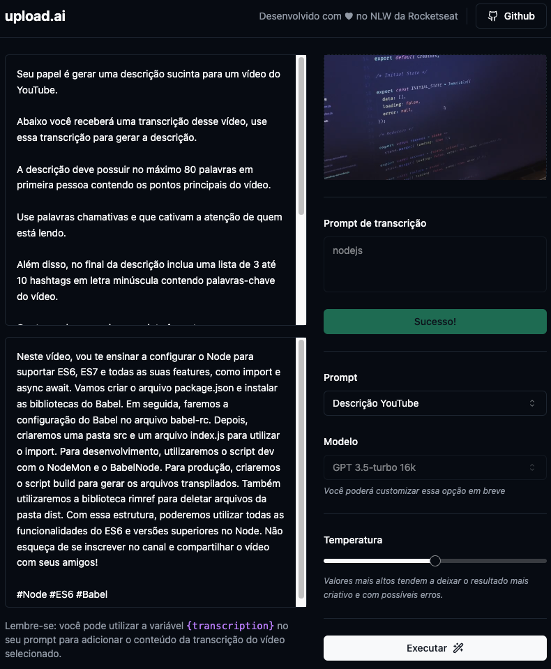

<h1 align="center">Upload.ai</h1>
<p align="center">Generate titles, descriptions, and video materials using AI.</p>

<p align="center">
 <a href="#about">About</a> •
 <a href="#technologies">Technologies</a> •
 <a href="getting">Getting Started</a> •
 <a href="screenshot">Screenshots</a> •
 <a href="#author">Author</a>
</p>

## About
<p align="justify">
  Upload.ai is a video uploading tool for YouTube that uses Artificial Intelligence to automatically generate titles, descriptions, and video materials.
</p>

## Technologies
The applications's been developed using the following technologies:
- Typescript;
- Node.js;
- ReactJS;
- Vite;
- TailwindCSS;
- Shadcn/UI;
- Prisma;
- SQLite;
- ffmpeg.wasm;
- OpenAI;
- Vercel AI SDK;


## Getting started
```bash
# Clone this repository
$ git clone https://github.com/btadashi/nlw-ai
```
### Web
```bash
# Navigate to the folder 'upload-ai-web'
$ cd upload-ai-web

# Install all dependencies
$ npm install

# Start application:
$ npm run dev
```

### API
```bash
# Navigate to the folder 'upload-ai-api':
$ cd upload-ai-api

# Install all dependencies:
$ npm install

# Run migrations:
$ npx prisma migrate dev

# Start application:
$ npm run dev
```
#### OPENAI API KEY
You must generate an API key for OPENAI API usage:
1. Log in to openai.com;
2. Click in 'View API keys' in your profile;
3. Click in 'Create new secret key';
4. Copy your secret key and paste it into the .env file in the root directory;


## Screenshots
 <div align="center">
  
</div>

## Author
This project's been developed by <a href="https://www.linkedin.com/in/bruno-yamaguchi/">Bruno Yamaguchi</a> NLW-IA.
